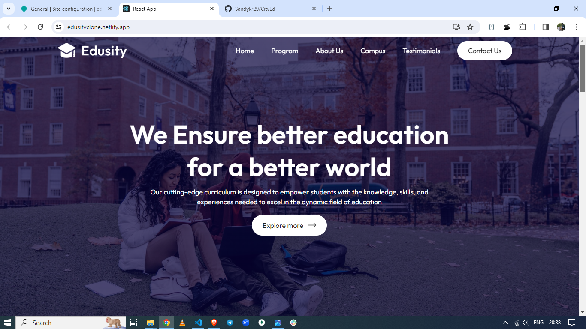
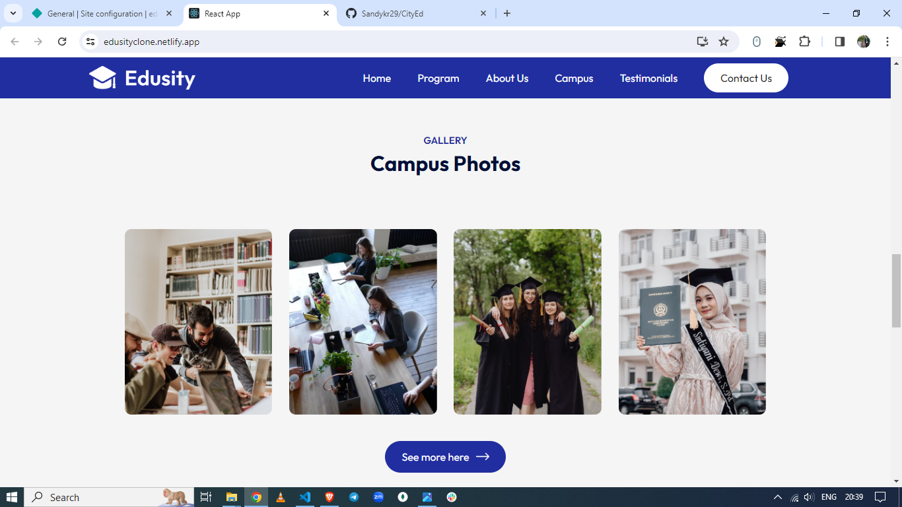
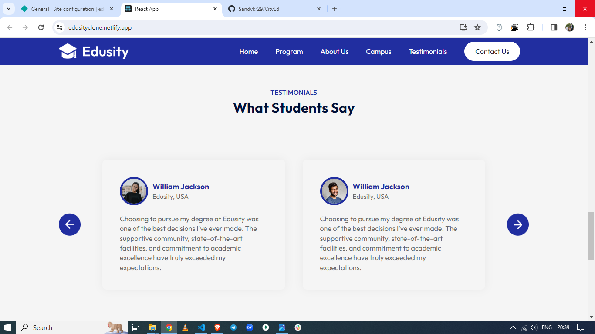
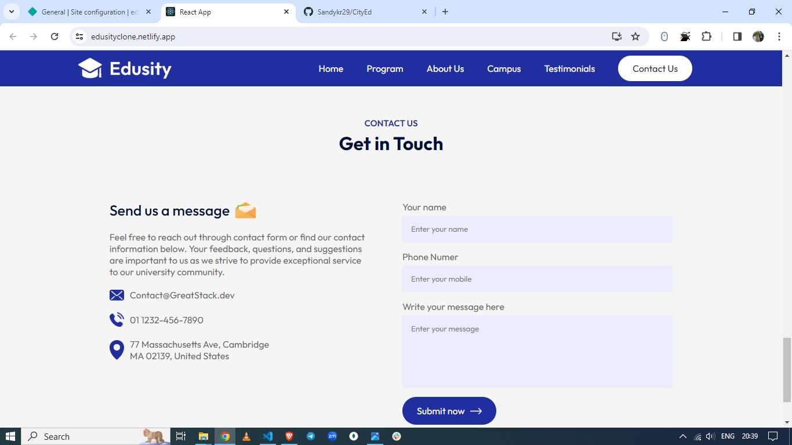

# EduCity

EduCity is a React-based website project created by Sandeep Kumar. It showcases a fictional university that offers various graduation degrees. The website is built using ReactJS, HTML, CSS, and JavaScript.

## Deployment

The website is currently deployed and accessible at: [EduCity Deployed Link](https://cloneedusity.netlify.app/)

## Features

- Displays information about the university
- Lists available graduation degrees
- Provides details about each degree program
- Allows users to explore the website easily with a responsive design

## Technologies Used

- ReactJS
- HTML
- CSS
- JavaScript

## Pages

- **Home**: Landing page with general information about the university.
 

- **Program**: Displays available graduation degrees with detailed information.
  

- **About Us**: Provides information about the university's history, mission, and values.
  

- **Campus**: Showcases images and details of the university campus.
  

- **Testimonials**: Features testimonials from students or alumni.
  

- **Contact**: Allows users to get in touch with the university.
  

## Images

Images for the pages mentioned above can be found in the `assets` folder.

## Author

- Sandeep Kumar

## Getting Started

To run the EduCity project locally, follow these steps:

1. Clone this repository: `git clone https://github.com/Sandykr29/CityEd.git`
2. Navigate to the project directory: `cd educity`
3. Install dependencies: `npm install`
4. Start the development server: `npm start`
5. Open your browser and visit: `http://localhost:3000`

## Contributing

Contributions are welcome! If you find any issues or have suggestions for improvements, please feel free to open an issue or submit a pull request.
